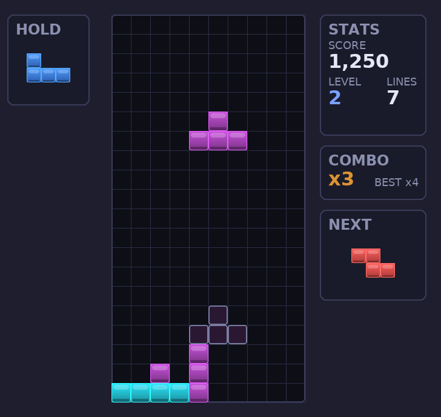
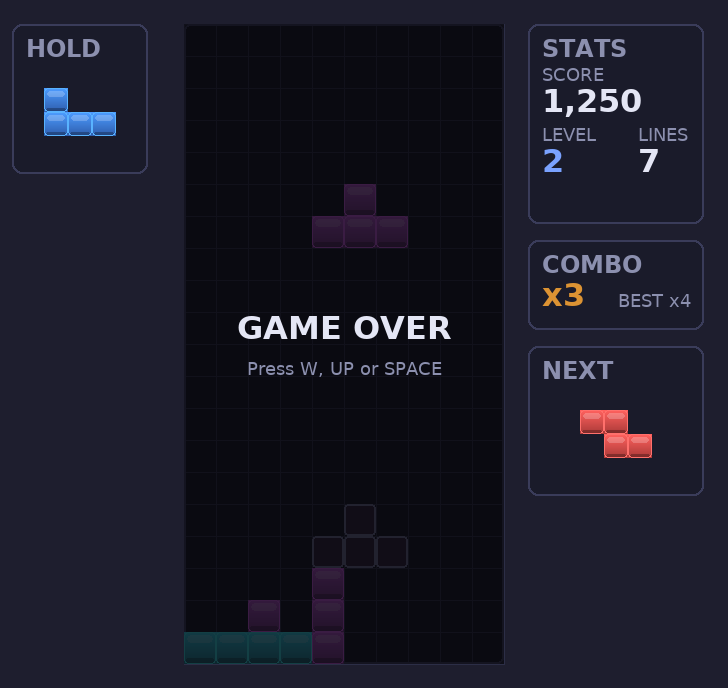

# Tetris 🟦🟥🟨

A fully playable, **modern-restyled Tetris** clone written in Python with [Pygame](https://www.pygame.org/).
It pairs the classic seven-tetromino gameplay with a sleek dark interface, glossy gradient
blocks, and three modern gameplay innovations — a Hold Piece slot, a Combo scoring system,
and tactile screen shake on hard drops.

---

## 🎨 Modern Restyle

The whole interface has been redesigned for a clean, contemporary look:

- **Dark gradient background** — a deep slate-to-indigo vertical gradient instead of flat black.
- **Glossy gradient blocks** — every cell is shaded top-to-bottom with a glossy highlight and a
  soft drop shadow, giving the pieces a rounded, three-dimensional feel.
- **Vibrant modern palette** — refreshed, slightly desaturated piece colours that pop against
  the dark well.
- **Rounded UI panels** — bordered, rounded panels for the Hold, Stats, Combo, and Next areas,
  with a recessed playfield "well" and subtle grid lines.
- **Translucent ghost piece** — the landing preview is now a soft, colour-tinted ghost rather
  than a plain outline.

---

## 🚀 The 3 Gameplay Innovations

1. **Hold Piece** — press **C** (or **Shift**) to stash the active piece in a dedicated Hold
   slot and bring it back later. If the slot is empty the next piece spawns; otherwise the held
   and active pieces swap. You may only hold once per drop (the slot dims to show it's locked),
   keeping the mechanic strategic rather than abusable.
2. **Combo scoring system** — clearing lines on consecutive piece locks builds a **combo chain**.
   Each successive clear adds an escalating bonus (`50 × combo × level`) on top of the normal
   line score. A live `xN` combo counter pulses in the sidebar and tracks your best chain;
   locking a piece without clearing a line resets the chain.
3. **Screen shake on hard drop** — slamming a piece down with **Space** produces a tactile screen
   shake that scales with the drop distance, and clearing lines adds an extra jolt sized to the
   number of rows cleared — landing a Tetris really feels like one.

---

## ✨ Core Features

- All 7 official tetrominoes (I, O, T, S, Z, J, L) with full rotation states
- **7-bag randomiser** — every piece appears once per bag, just like modern Tetris
- **Ghost piece** showing where the current piece will land
- **Hard drop**, **soft drop**, and clockwise / counter-clockwise rotation
- Score, level, line, and combo counters in the sidebar
- Difficulty ramps up: the fall speed increases every 10 cleared lines
- Pause, resume, and restart without leaving the game

---

## 🖥️ System Requirements

| Requirement | Details                                   |
|-------------|-------------------------------------------|
| OS          | Windows, macOS, or Linux                  |
| Python      | 3.8 or newer                              |
| Library     | `pygame` 2.5.0 or newer                   |
| Display     | A graphical environment (not a headless terminal) |

---

## 🚀 Installation & Execution

1. **Clone the repository**

   ```bash
   git clone https://github.com/<your-account>/tetris-game.git
   cd tetris-game
   ```

2. **(Recommended) Create and activate a virtual environment**

   ```bash
   python3 -m venv .venv
   source .venv/bin/activate      # On Windows: .venv\Scripts\activate
   ```

3. **Install the dependencies**

   ```bash
   pip install -r requirements.txt
   ```

4. **Run the game**

   ```bash
   python tetris.py
   ```

---

## 🎮 Controls

| Key                | Action                          |
|--------------------|---------------------------------|
| ← / →              | Move the piece left / right     |
| ↓                  | Soft drop (faster fall)         |
| ↑ or **X**         | Rotate clockwise                |
| **Z**              | Rotate counter-clockwise        |
| **Space**          | Hard drop (instant drop)        |
| **C** or **Shift** | Hold piece (swap with hold slot)|
| **P**              | Pause / resume                  |
| **R**              | Restart (after Game Over)       |
| **Esc**            | Quit                            |

### Scoring

| Lines cleared at once | Points (× current level) |
|-----------------------|--------------------------|
| 1 (Single)            | 100                      |
| 2 (Double)            | 300                      |
| 3 (Triple)            | 500                      |
| 4 (**Tetris!**)       | 800                      |

Soft drops award 1 point per cell, hard drops 2 points per cell. Consecutive line clears
also build a **combo**, adding a `50 × combo × level` bonus for each clear in the chain.

---

## 📸 Screenshots

> _Placeholder — add your own gameplay screenshots here._

| Gameplay | Game Over |
|----------|-----------|
|  |  |

_To capture a screenshot, run the game and use your operating system's screenshot tool,
then drop the images into a `docs/` folder with the file names referenced above._

---

## 🧠 Fun Facts About Tetris

- **Tetris was born in the USSR.** It was created in 1984 by Soviet software engineer
  **Alexey Pajitnov** at the Soviet Academy of Sciences in Moscow.
- **The name** is a blend of *tetra* (Greek for "four" — every piece is made of four cells)
  and *tennis*, Pajitnov's favourite sport.
- There are exactly **seven** distinct tetromino shapes, collectively known as the
  *tetrominoes*: I, O, T, S, Z, J, and L.
- A four-line clear is called a **"Tetris"** — the highest-scoring single move in the game.
- Tetris is one of the **best-selling video game franchises of all time**, with hundreds of
  millions of copies sold across virtually every platform ever made.
- Researchers describe the **"Tetris effect"**: play long enough and you may start seeing
  falling blocks in your dreams or imagining how real-world objects fit together.
- Tetris has been played **in space** — it has flown aboard spacecraft and is a favourite
  among astronauts.

---

## 📄 License

Released under the MIT License. Feel free to play, modify, and share.
